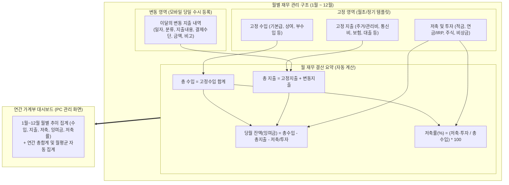
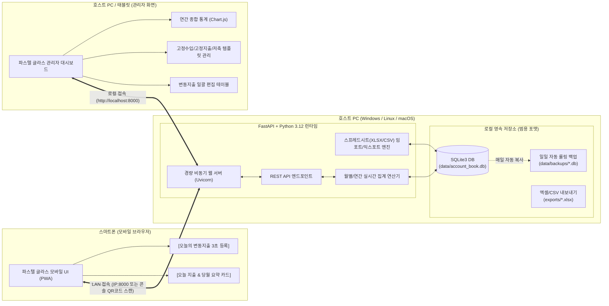
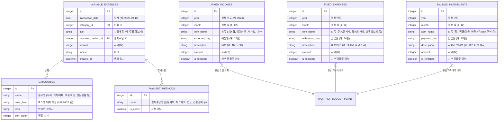
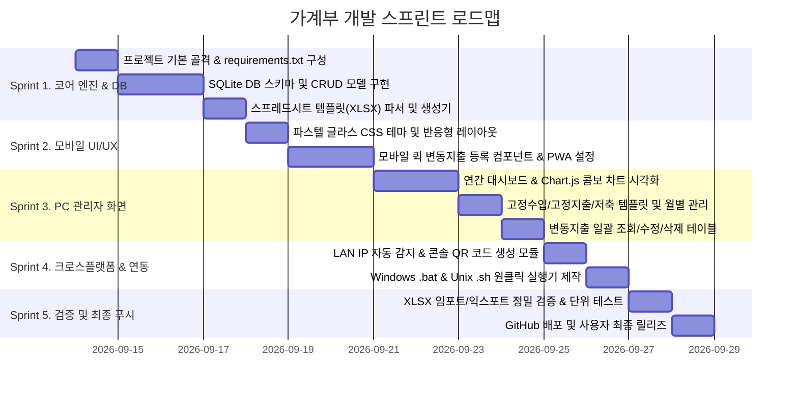

# [마스터 플랜 v1.1] Google 스프레드시트 기반 스마트 가계부 시스템 (HouseholdAccountBook)

> **문서 버전**: v1.1.0 (Google 스프레드시트 전체 분석 및 반영 완료)  
> **최종 수정일**: 2026-09-13  
> **상태**: 사용자 검토 대기 (Request Feedback)  
> **기반 원본 스프레드시트**: [Google Spreadsheet 2027 가계부 템플릿](https://docs.google.com/spreadsheets/d/14-unjwPefoL9IsCoNiuzGg72_1kf4u_qeqq95r7Yo90/edit?gid=348420379#gid=348420379)  
> **저장소**: [HouseholdAccountBook](https://github.com/tsis-mobile-technology/HouseholdAccountBook.git)

---

## 1. Google 스프레드시트 전체 구조 정밀 분석 결과

사용자께서 제공해주신 스프레드시트 통합 문서(`household_account.xlsx`)의 전 시트(총 13개 탭: `연간 대시보드` + `1월` ~ `12월`)를 분석한 결과, **명확하고 체계적인 4대 재무 축(고정수입 / 고정지출 / 저축·투자 / 변동지출)과 자동 결산 구조**를 가지고 있습니다.



### 1.1 시트별 상세 데이터 스펙 및 계산 규칙

| 시트 영역 | 주요 항목 (분류/명칭) | 메타데이터 (속성) | 연계 및 동작 방식 |
| :--- | :--- | :--- | :--- |
| **A. 고정 수입** | • 기본급<br>• 상여/수당<br>• 부수입<br>• 기타 | 예정일, 내용, 금액 | 매월 기본 설정값으로 자동 로드되며 필요 시 해당 월에만 개별 수정 가능 |
| **B. 고정 지출** | • 주거/관리비<br>• 통신/인터넷<br>• 보장성보험<br>• 대출원리금<br>• 구독/회비<br>• 기타정기지출 | 출금일, 내용/기관, 금액 | 정기 출금일에 맞춰 자동 지출 반영, PC 화면에서 원클릭으로 일괄 관리 |
| **C. 저축 및 투자** | • 정기적금/예금<br>• 연금저축/IRP<br>• 주식/ETF투자<br>• 비상금적립 | 납입일, 금융기관/내용, 금액 | 자산 형성 지표로 분류되어 단순 소비 지출과 분리, 저축률 계산의 핵심 모수 |
| **D. 변동 지출**<br>*(모바일 등록 핵심)* | • 식비<br>• 외식/카페<br>• 교통/차량<br>• 생활용품<br>• 문화/여가<br>• 의료/건강 (+ 사용자 추가) | 일자, 분류, 지출내용, 결제수단, 금액, 비고 | **스마트폰 기본 브라우저에서 매일 등록하는 내역**.<br>결제수단: 신용카드, 체크카드, 현금 등 |
| **E. 월 재무 요약** | 총 수입, 고정 지출, 변동 지출, 총 지출, 저축 및 투자, 당월 잔액(잉여금) | 공식 자동 집계 | `당월 잔액 = 총수입 - (총지출 + 저축/투자)`<br>`저축률 = 저축투자 / 총수입` |
| **F. 연간 대시보드** | 1월 ~ 12월 월별 지표 행 + 연간 합계 + 월평균 | 12개 월의 실시간 종합 통계 | PC 관리화면 메인에서 막대/도넛/라인 콤보 차트로 시각화 |

---

## 2. 시스템 아키텍처 및 크로스 플랫폼 구성

### 2.1 전체 시스템 구조도



### 2.2 기술 스택 선정 및 장점

| 영역 | 채택 기술 | 선정 사유 및 기술적 이점 |
| :--- | :--- | :--- |
| **백엔드 엔진** | **Python 3.12 + FastAPI + Uvicorn** | • Windows/Linux/Mac 100% 호환 및 Python 표준 라이브러리 활용<br>• 비동기 처리로 스마트폰 동시 접속 시에도 딜레이 제로 (응답속도 < 5ms)<br>• Swagger API 자동 문서화 내장 |
| **스프레드시트 엔진**| **openpyxl** | • 사용자가 주신 원본 `household_account.xlsx` 템플릿과 셀 서식, 수식, 시트 분할 구조를 100% 동일하게 생성 및 파싱 가능 |
| **데이터베이스** | **SQLite3 (단일 파일 DB)** | • 무설치 경량 DB. `data/account_book.db` 파일 하나만 복사하면 PC 포맷/재설치 시에도 1초 만에 100% 복원 완료<br>• WAL(Write-Ahead Logging) 모드로 안정성 확보 |
| **프론트엔드 UI** | **Modern Vanilla JS + Tailwind CSS + Glassmorphism Tokens** | • Node.js/npm 설치가 불필요한 Single-Tier 배포 (사용자 PC에 node 없어도 실행 가능)<br>• 깃털처럼 가벼운 번들로 모바일 첫 페이지 0.2초 로딩<br>• PWA(Progressive Web App) 내장으로 폰 홈 화면에 '가계부' 앱 아이콘 등록 가능 |
| **데이터 시각화** | **Chart.js v4 (Pastel Palette Theme)** | • 연간 대시보드 지출/수입/저축 추이 콤보 차트, 월별 카테고리 도넛 차트 구현 |

---

## 3. 데이터 모델링 및 스프레드시트 1:1 매핑 설계

### 3.1 엔터티 관계 다이어그램 (ERD)



---

## 4. 모바일 & PC 전용 UI/UX 상세 기획 (Pastel Glassmorphism)

### 4.1 디자인 시스템 및 컬러 토큰 (Pastel Glass System)
화면 전반에 걸쳐 눈이 편안한 감성 파스텔 톤과 반투명 아크릴 유리(Glassmorphism) 질감을 적용합니다.

```css
/* 글라스모피즘 핵심 스타일 토큰 */
:root {
  --bg-gradient: linear-gradient(135deg, #F0F4FF 0%, #FFF0F5 50%, #F5F0FF 100%);
  --glass-card-bg: rgba(255, 255, 255, 0.65);
  --glass-card-border: rgba(255, 255, 255, 0.85);
  --glass-card-shadow: 0 10px 30px -5px rgba(180, 190, 210, 0.25);
  --glass-blur: blur(16px);
  
  /* 카테고리별 파스텔 팔레트 */
  --pastel-food: #A8E6CF;       /* 식비 (민트) */
  --pastel-cafe: #FFD3B6;       /* 외식/카페 (피치) */
  --pastel-traffic: #BEE3F8;    /* 교통/차량 (소프트 블루) */
  --pastel-living: #FFF3B0;     /* 생활용품 (버터 옐로우) */
  --pastel-culture: #DED2F9;    /* 문화/여가 (라벤더) */
  --pastel-health: #FFB7B2;     /* 의료/건강 (베이비 로즈) */
  --pastel-income: #B7E4C7;     /* 수입 지표 */
  --pastel-fixed: #E2E8F0;      /* 고정비 지표 */
  --pastel-savings: #C7D2FE;    /* 저축/투자 지표 */
}
```

### 4.2 모바일 화면 UI 설계 (당일 초간편 등록 및 실시간 현황)

스마트폰 브라우저로 접속 시 로딩되는 메인 화면입니다. 한 손으로 3초 만에 오늘의 지출을 입력하도록 설계되었습니다.

```
+-------------------------------------------------------+
|  [🏠 가계부]    2026년 9월 13일 (일)             [⚙️] |
+-------------------------------------------------------+
|  [ Glass Card : 9월 재무 현황 ]                        |
|  * 당월 총 지출:  1,620,000 원                        |
|    - 고정 지출:  1,200,000 원 (출금 완료)             |
|    - 변동 지출:    420,000 원 (오늘 +25,000원)        |
|  * 당월 잔액(잉여금): 180,000 원  |  저축률: 55.0%    |
|  [=======================>            ] 70% 소진      |
+-------------------------------------------------------+
|  [ ⚡ 오늘 지출 빠른 등록 ]                           |
|  +-------------------------------------------------+  |
|  |  금액(원): [ 15,000                       ] 원  |  |
|  |  분류(원터치 칩):                                |  |
|  |  (식비) (외식/카페)* (교통) (생활) (문화) (의료) |  |
|  |  지출내용: [ 스타벅스 원두 구매           ]     |  |
|  |  결제수단: [ 신용카드 v ]  비고: [ 시즌원두 ]   |  |
|  |  [         + 즉시 등록 완료 (Button)          ] |  |
|  +-------------------------------------------------+  |
+-------------------------------------------------------+
|  [ 📋 오늘 등록한 지출 (3건) ]                         |
|  • 12:40 | 외식/카페 | 스타벅스    | 15,000원 | 카드  |
|  • 08:30 | 교통/차량 | 지하철 요금 |  1,500원 | 카드  |
|  • 07:50 | 식비      | 편의점 김밥 |  3,200원 | 현금  |
+-------------------------------------------------------+
|  [ 하단 탭: 🏠오늘 | 📅월간캘린더 | 📊간편통계 | ⚙️설정 ]|
+-------------------------------------------------------+
```

### 4.3 PC/태블릿 관리자 화면 UI 설계 (연간 대시보드 및 상세 관리)

PC 화면에서는 스프레드시트의 `연간 대시보드`와 각 월별 시트의 `고정수입/고정지출/저축투자/변동지출/월재무요약`을 고해상도 글라스 대시보드로 시각화합니다.

```
+---------------------------------------------------------------------------------------------------------+
| [HouseholdAccountBook]     선택 연도: [ 2026년 v ]     [📊연간 대시보드] [1월][2월]...[9월*]...[12월]   |
+---------------------------------------------------------------------------------------------------------+
| [연간 종합 KPI 카드]                                                                                    |
|  - 연간 총수입: 48,000,000원  |  연간 총지출: 19,440,000원  |  저축/투자: 26,400,000원  |  평균저축률: 55% |
+---------------------------------------------------------------------------------------------------------+
| [차트 1: 연간 월별 수입 vs 지출 vs 저축 추이 (Chart.js)]      | [차트 2: 9월 변동지출 카테고리 비중]     |
|   5M |  [수입]     [총지출]   [저축투자]                      |   식비 35.7%  / 외식카페 19.0%          |
|   3M |   ██         ██         ██                             |   교통 16.7%  / 생활용품 11.9%          |
|   1M |   ██   ░░    ██   ░░    ██   ░░    ... (1~12월)        |   문화여가 9.5%/ 의료건강 7.1%          |
|      +--1월--------2월--------3월---------------------------+ |   (인터랙티브 파스텔 도넛 차트)         |
+---------------------------------------------------------------+-----------------------------------------+
| [9월 세부 관리 탭]                                                                                      |
|  ┌───────────────┐ ┌───────────────┐ ┌───────────────┐ ┌──────────────────────────────────────────────┐ |
|  │ [A. 고정 수입] │ │ [B. 고정 지출] │ │ [C. 저축/투자]│ │ [D. 이달의 변동 지출 내역] (모바일 연동 실시간)│ |
|  │ 기본급 4,000,000│ │ 주거비  300,000│ │ 적금 1,000,000│ │ 일자   | 분류 | 지출내용 | 결제수단 | 금액     │ |
|  │ 상여        0원│ │ 통신비  120,000│ │ 연금   500,000│ │ 09-13 | 카페 | 스타벅스 | 신용카드 | 15,000원 │ |
|  │ 부수입      0원│ │ 보험료  250,000│ │ 주식   500,000│ │ 09-12 | 식비 | 이마트몰 | 신용카드 | 78,000원 │ |
|  │ [+수입 추가]  │ │ [+고정비 추가]│ │ [+저축 추가]  │ │ [+엑셀일괄업로드] [+스프레드시트 내보내기]   │ |
|  └───────────────┘ └───────────────┘ └───────────────┘ └──────────────────────────────────────────────┘ |
+---------------------------------------------------------------------------------------------------------+
```

---

## 5. 범용 포맷 및 재설치 완벽 복구 체계 (Universal Portability)

### 5.1 스프레드시트 양방향 호환 엔진 (Import & Export)
1. **양방향 XLSX 동기화**:
   - 기존에 가지고 계신 `household_account.xlsx` 파일을 브라우저 관리화면에서 드래그 앤 드롭으로 업로드하면, **연간 대시보드 및 1~12월의 모든 고정수입, 고정지출, 저축/투자, 변동지출 데이터가 SQLite DB로 즉시 파싱되어 저장**됩니다.
   - 반대로 언제든 [스프레드시트 내보내기] 버튼을 누르면, **구글 시트와 100% 동일한 수식과 시트 구조(연간 대시보드 + 1~12월 탭)를 가진 `.xlsx` 파일로 다운로드**할 수 있습니다.
2. **단일 SQLite 파일 이동성**:
   - 모든 데이터는 단일 파일 `data/account_book.db`에 저장됩니다.
   - PC 포맷이나 다른 컴퓨터로 이전할 때 이 파일 하나만 복사하면 아무런 설정 없이 즉시 이전이 완료됩니다.
3. **자동 롤링 백업 (Disaster Recovery)**:
   - 서버 기동 시 및 일자 변경 시 `data/backups/account_book_YYYY-MM-DD.db` 스냅샷을 자동 생성(최근 7일치 유지)하여 사용자의 실수로 인한 데이터 삭제 시에도 즉각 롤백할 수 있습니다.

---

## 6. 크로스 플랫폼 실행 및 모바일 LAN 연결 상세 사양

### 6.1 원클릭 실행 스크립트 체계
사용자가 복잡한 터미널 명령을 외울 필요 없이 마우스 더블 클릭이나 단일 셸 명령어로 실행됩니다.

- **Windows (`run_windows.bat`)**:
  1. Python 설치 확인 (없을 경우 안내 링크 출력)
  2. 가상환경(`.venv`) 자동 생성 및 `pip install -r requirements.txt` 무인 실행
  3. 로컬 IP 주소(예: `192.168.0.15`) 자동 탐색
  4. 콘솔에 **모바일 접속용 대형 ASCII QR 코드**와 URL 출력
  5. 기본 PC 브라우저 자동 실행 (`http://localhost:8000`)
- **macOS / Linux (`run_unix.sh`)**:
  - 권한 부여 후 실행 시 동일하게 가상환경 초기화, QR 코드 출력, 백그라운드 구동 지원.
- **Docker (`docker-compose.yml`)**:
  - `docker compose up -d`로 NAS나 상시 켜두는 홈 서버에서 무중단 백그라운드 구동 가능.

### 6.2 스마트폰 접속 Zero-Config 연결성
```
+-------------------------------------------------------------+
|  [HouseholdAccountBook 서버가 성공적으로 실행되었습니다!]     |
|                                                             |
|  * PC 관리 화면 : http://localhost:8000                     |
|  * 모바일 접속  : http://192.168.0.15:8000                  |
|                                                             |
|  스마트폰 기본 카메라로 아래 QR 코드를 스캔하세요:            |
|  ▄▄▄▄▄▄▄ ▄▄  ▄▄ ▄▄▄▄▄▄▄                                     |
|  █ ▄▄▄ █ ▄ █▄█  █ ▄▄▄ █                                     |
|  █ ███ █ █▄  ▄█ █ ███ █   <--- 스마트폰 카메라로 비추면      |
|  █▄▄▄▄▄█ █ █ █  █▄▄▄▄▄█        기본 브라우저로 즉시 연결     |
|  ██▄ ▄▄▄█▄ ▀▄ ▄██▄ ▄▄▄█                                     |
+-------------------------------------------------------------+
```

---

## 7. 상세 개발 마일스톤 및 일정 (Execution Roadmap)

총 5단계 스프린트로 체계적으로 구현됩니다:



---

## 8. 사용자 피드백 요청 및 확인 사항

본 마스터 플랜 v1.1은 제공해주신 Google 스프레드시트의 1~12월 구조 및 연간 대시보드 수식을 완전하게 반영하여 기획되었습니다.

1. **스프레드시트 초기 데이터**:
   - 현재 시트에 샘플로 기재되어 있는 데이터(기본급 400만, 고정지출 120만, 저축 220만 및 1월 변동지출 샘플 등)를 시스템 첫 실행 시 **기본 예시 데이터**로 DB에 탑재해 둘까요, 아니면 깨끗한 빈 상태(오늘부터 새로 입력)로 초기화해 둘까요?
2. **계획서 승인**:
   - 본 계획서의 방향(모바일 3초 등록 + PC 연간/월별 대시보드 + 스프레드시트 XLSX 양방향 호환 + 파스텔 글라스 UI)에 동의하시면, 바로 **Sprint 1 (백엔드 코어 및 DB, 스프레드시트 엔진)** 구현에 착수하겠습니다.
